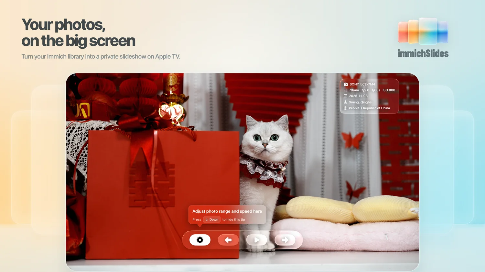
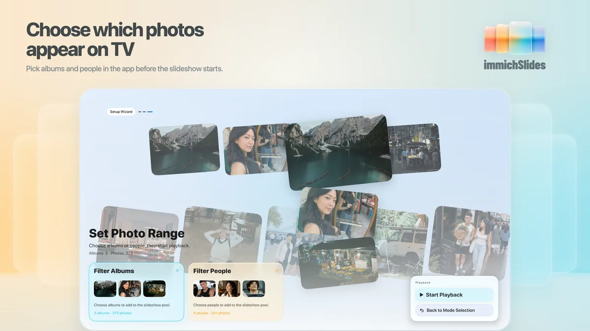
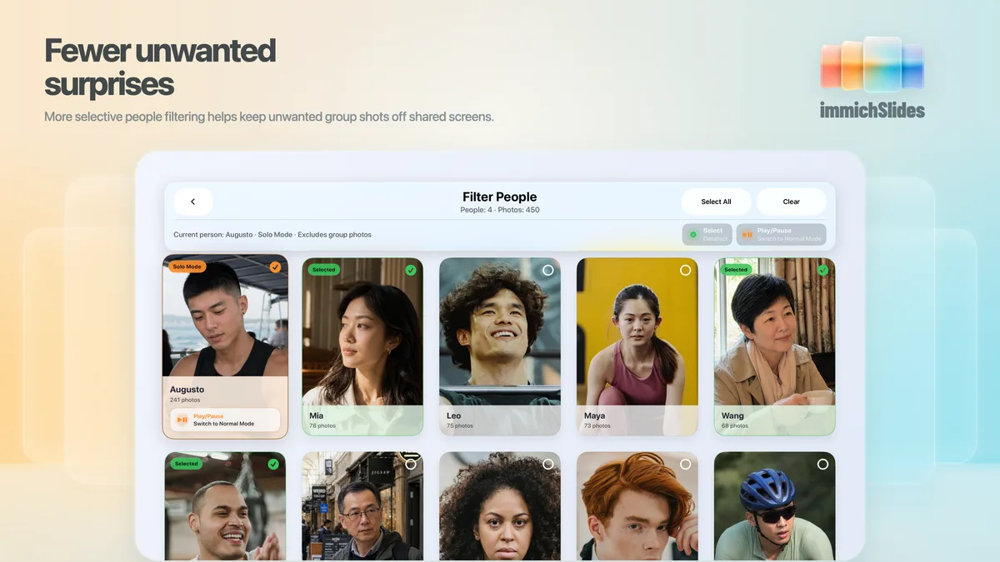
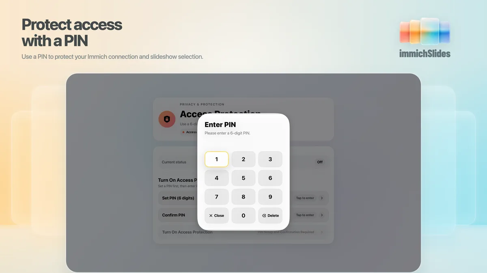

  

# immichSlides — Immich slideshows for Apple TV, iPad, and iPhone

**Your Immich photos, back in view.**

If you already keep your photos in a self-hosted Immich library, immichSlides brings them back onto the screens you actually see: Apple TV in the living room, an iPad on a shelf, or an iPhone on a nightstand.

  <a href="https://apps.apple.com/app/apple-store/id6764543664?pt=128838980&ct=github&mt=8"><strong>Download on the App Store — free, no ads</strong></a>
  ·
  <a href="https://slides.by331.net/">Website</a>
  ·
  <a href="https://slides.by331.net/support/">Support</a>
  ·
  <a href="https://github.com/by331works/immichSlides/issues">Public Issues</a>
  ·
  <a href="README.zh-Hans.md">中文 README</a>

  

## Your photos are saved. But do you still see them?

Immich is great at keeping a photo library organized. Phone photos, camera shots, trips, family moments, pets, portfolios — all finally have a place to live.

But once photos are safely stored, they can still disappear into the archive.

You know they are on your server. You know they are stored, organized, and recognized by Immich. But the TV in the living room, the iPad on a side table, or the spare iPhone by the bed still rarely brings those memories back into view.

immichSlides focuses on that missing last step: **not another full Immich client, but a quiet slideshow layer for your own Immich library.**

## Why you might want it on your Apple devices

### Turn Apple TV, iPad, and iPhone into Immich photo displays

Apple TV works well for the living room. An iPad can sit on a desk, shelf, or nightstand. An iPhone can become a quick preview screen or a small always-nearby frame.

Open immichSlides, connect your own Immich server, choose albums, people, or a full-library shuffle, and let your photos play where you will actually see them.

### No need to rebuild a slideshow library

You do not need to export photos, hand-pick a separate set, maintain another album just for slideshows, or move anything into another cloud service.

immichSlides uses your existing Immich albums and Immich People. You choose what can play; the app handles the slideshow.

### Use the Apple screens you already own

If you already have an Apple TV, iPad, or older iPhone at home, those screens often make better photo displays than a dedicated digital frame.

immichSlides lets those devices play directly from your self-hosted Immich library: a TV for the family room, an iPad for a quiet corner, or an iPhone for quick playback.

## Screenshots

These screenshots are here to show the feel of the app and a few important screens. They are not meant to be a complete feature map.

The playback screen is shown near the top. Below are the selection, people filtering, and PIN protection screens — the parts that help decide whether the app fits a shared-screen setup.

### Choose what can play

  

Before a slideshow starts, you can choose the scope: full library, albums, or people.

That means the organization work you already did in Immich can become the slideshow source. No extra slideshow folders required.

### People filtering

  

People filtering is part of the broader selection flow. It is shown separately because it matters most on shared screens.

Once photos appear on a TV, iPad, or other shared device, they are no longer just private browsing. Single-person mode helps reduce group shots, extra people, and photos meant for a smaller audience from appearing.

It cannot guarantee perfect results, but it gives you more control over what reaches the room.

### PIN protection

  

Apple TV, iPad, and iPhone can all be shared devices. PIN protection helps keep others from casually changing the Immich connection, switching the slideshow scope, or reaching photos you did not mean to show.

## More details

### Shared devices still need boundaries

immichSlides can protect the Immich connection and slideshow selection with a 6-digit PIN, so a display device can be shared without giving everyone control over what appears.

### Photo details stay with the image

If you care about the story behind a shot, immichSlides can show camera, lens, focal length, aperture, shutter speed, ISO, date, and location while photos play.

For photographers, those details can be part of the memory too.

### Free, with no ads

The current version is free and has no ads.

The goal is simple: give people who already use Immich a calmer, more useful photo display layer for Apple devices.

## Best for

- people already using Immich for a self-hosted photo library;
- anyone who wants Apple TV, iPad, or iPhone to become a photo display;
- homes with an older iPad or iPhone that could still be useful;
- people with years of photos they rarely revisit;
- users who want slideshows by album, people, or full library;
- shared-screen situations where fewer awkward surprises matter;
- anyone who does not want to move photos into another cloud photo service.

## What it is not

immichSlides is not the official Immich app and is not affiliated with, endorsed by, or sponsored by Immich.

It is not a full Immich client. It does not upload, delete, edit, back up, host, or share photos.

It focuses on one job: **turning your own Immich library into a slideshow experience for Apple TV, iPad, and iPhone.**

You need your own Immich server URL and API key to use it.

## Download

immichSlides is available on the App Store:

https://apps.apple.com/app/apple-store/id6764543664?pt=128838980&ct=github&mt=8

  <a href="https://apps.apple.com/app/apple-store/id6764543664?pt=128838980&ct=github&mt=8"><strong>Download immichSlides on the App Store — free, no ads</strong></a>

## Support and feedback

If your issue involves your Immich server URL, API key, private logs, personal photos, or children’s photos, please do not post it in public GitHub Issues. Use the private support options on the website instead:

https://slides.by331.net/support/

For public, non-sensitive issues — or feedback about the website, copy, or presentation — you can use GitHub Issues:

https://github.com/by331works/immichSlides/issues

## Support development

immichSlides is free and has no ads.

If it helps you bring your Immich photos back into view, you can support development on Ko-fi.

Support is optional and does not unlock any app features.

## License

Website code in this repository is licensed under the MIT License. Product copy, screenshots, images, logos, icons, and other brand/design assets are © 2026 331-Works, all rights reserved.

See [LICENSE.md](LICENSE.md) for details.

## What this repository is

This public repository is for website and discovery. It is not the app source code repository.

It contains public website files for immichSlides and public support pages.

It does not contain the immichSlides app source code or the production support backend.
